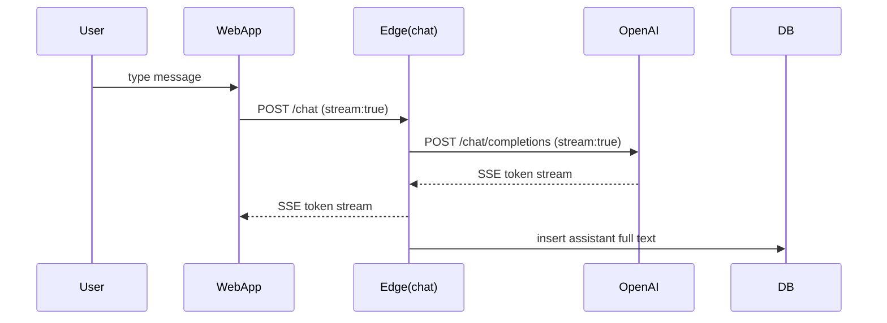

# Architecture
An SPA built with React and Tailwind communicates with Supabase Edge Functions for streaming chat.

## Sequence Diagram


### Why Chat Completions?

The initial prototype used the OpenAI Responses API which required an extra redirection step. This project now calls the Chat Completions API directly to reduce latency and simplify the stream handling. Tokens arrive as Server Sent Events and are forwarded to the browser in real time.

### Metrics & Logging

When `ENABLE_METRICS` is set, the edge function records the time to first token and stores it in the `edge_logs` table:

```json
{ "chat_id": "abc123", "latency_ms": 350 }
```

All assistant messages are persisted to the `chat_messages` table after the stream completes.
